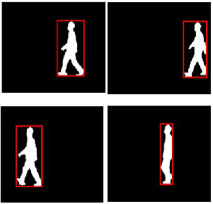
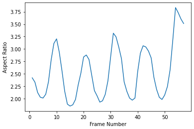

# **Gait Cycle Detection**

> In this project, the **CASIS B dataset** has been selected. Each object is then measured by height and width through a bounding box to calculate the aspect ratio. In Figure we noticed that the **bounding box** is wide when the 
legs are away from each other and narrow when the bounding box is close to the feet. This concept helps to identify the gait cycle by calculating the **aspect ratio**. Finally, we find the gait cycle represents **three local minima** in the aspect ratio curve.

###  
# 
